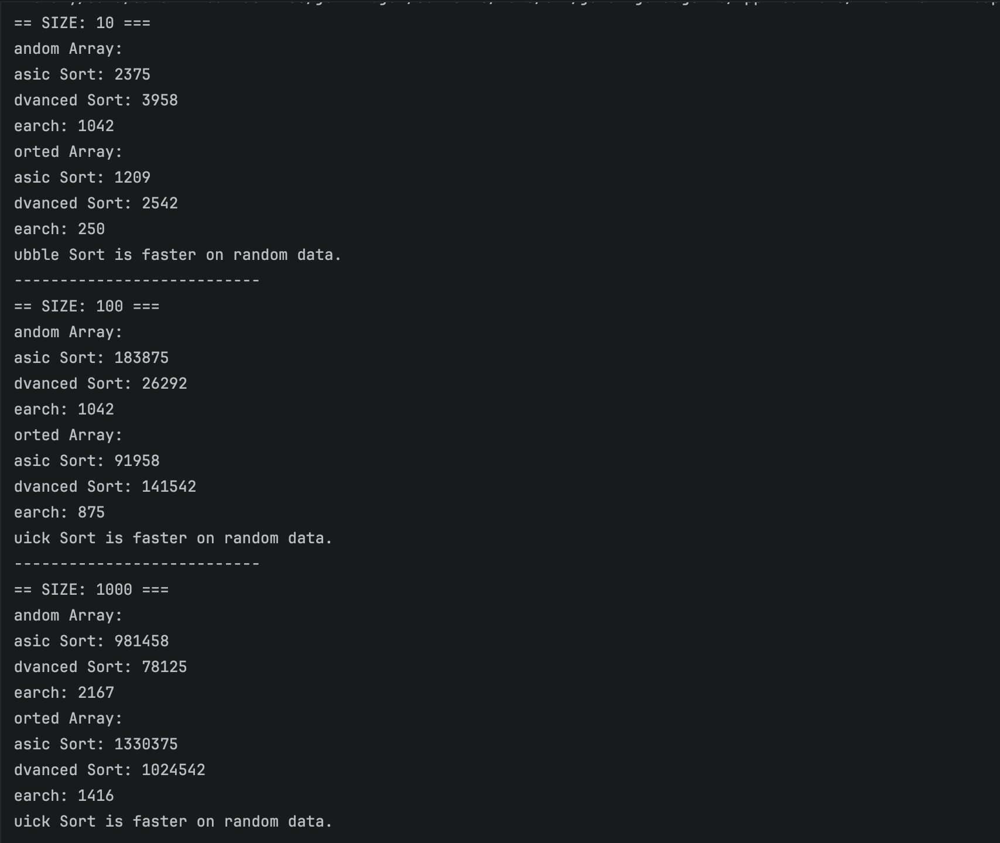

Assignment 3: Sorting and Searching Algorithm Analysis System
Learning Goals

This project demonstrates:

Implementation and comparison of sorting and searching algorithms
Application of Big-O notation in practice
Performance measurement using execution time
Use of object-oriented programming principles
Working with arrays of different sizes and structures
Writing clean and maintainable Java code
Presenting results in a structured README with screenshots
Maintaining an organized Git workflow
Implemented Algorithms

The following algorithms were selected:

Bubble Sort – basic sorting algorithm (O(n²))
Quick Sort – advanced sorting algorithm (O(n log n))
Linear Search – searching algorithm (O(n))
System Design

The program follows an object-oriented design with three main classes:

Sorter
Implements Bubble Sort and Quick Sort
Generates arrays
Prints arrays
Searcher
Implements Linear Search
Experiment
Runs performance tests
Measures execution time using System.nanoTime()
Compares results
Experiment Setup

Experiments were conducted using:

Array Sizes:
Small: 10 elements
Medium: 100 elements
Large: 1000 elements
Input Types:
Random arrays
Sorted arrays

Each algorithm was tested on all datasets.

Results and Analysis
Sorting Performance

Quick Sort performed significantly faster than Bubble Sort for medium and large arrays. For small arrays, Bubble Sort was sometimes faster due to lower overhead.

This confirms the theoretical time complexity:

Bubble Sort → O(n²)
Quick Sort → O(n log n)
Effect of Input Size

As the input size increased:

Bubble Sort execution time increased rapidly
Quick Sort remained efficient

This shows that inefficient algorithms are not suitable for large datasets.

Sorted vs Random Data
Bubble Sort performed faster on sorted arrays because fewer swaps were needed
Quick Sort performed worse on sorted arrays in this implementation

This happens because the pivot was chosen as the last element, leading to worst-case behavior.

Searching Performance

Linear Search was used for searching.

Execution time increased with array size
This is expected due to O(n) complexity
Comparison with Big-O Complexity

The experimental results match the expected Big-O behavior:

Bubble Sort showed quadratic growth
Quick Sort showed better scalability
Linear Search showed linear growth
Program Output

Below is an example of the program execution:

(Add your screenshot file here, for example output.png in the same folder)

Conclusion

Quick Sort is more efficient than Bubble Sort for large datasets, while Bubble Sort is only suitable for small or nearly sorted arrays.

Linear Search is simple but inefficient for large inputs.

The experiment shows that choosing the correct algorithm is important for performance.
